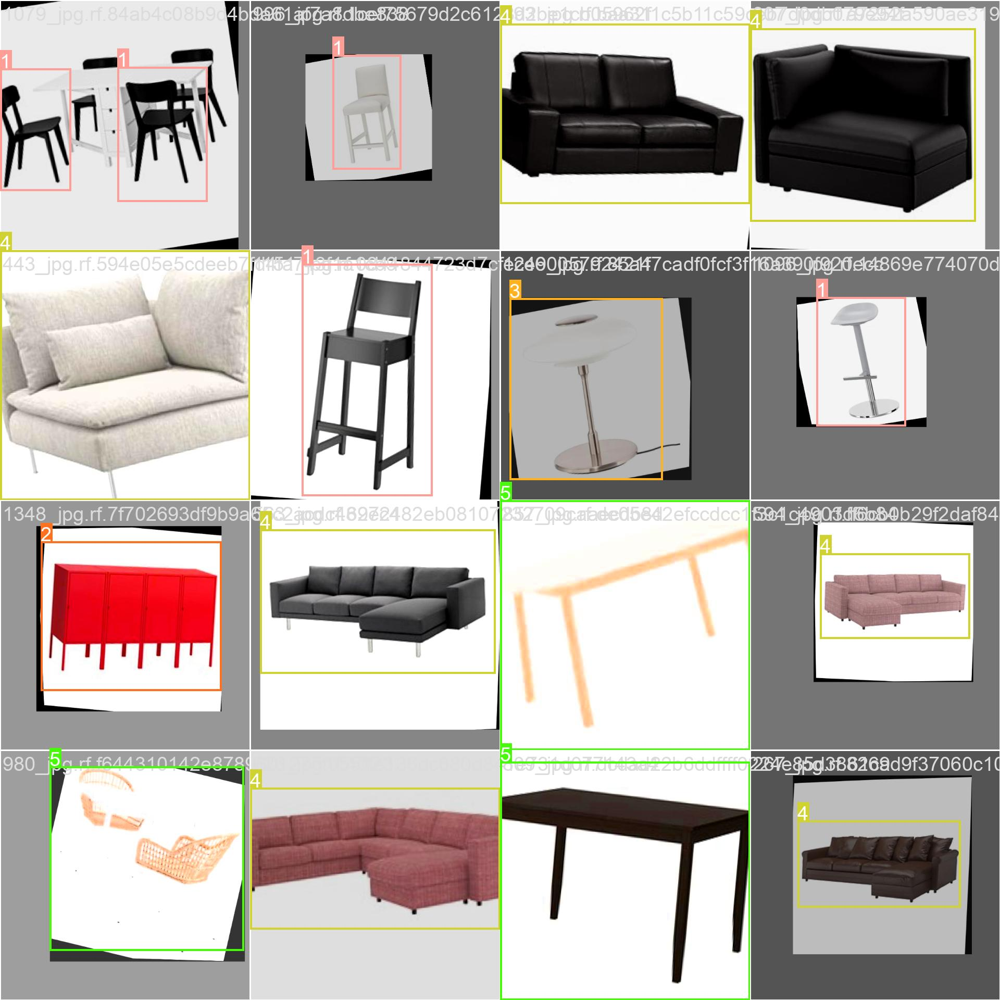

# Search for similar furniture in realtime using images

## Object detection:

- Used in Object Detection Model training (YOLO v8)
- Data train: https://universe.roboflow.com/furniture-pggl9/furniture-detection-new

## Similarity Detection

-  Applied transfer learning to generate vectors that encode the design feature of the furniture detected
-  Dataset: https://cvml.comp.nus.edu.sg/furniture/index.html